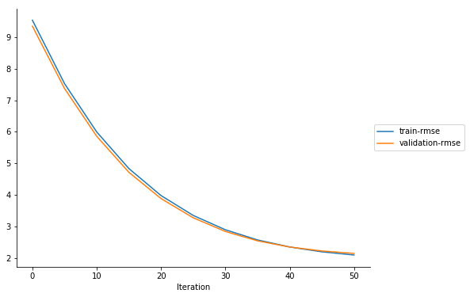
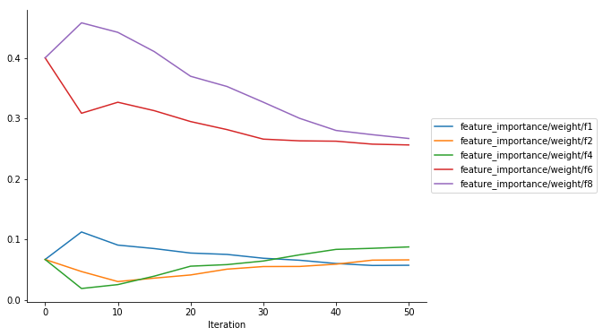

# Lab: Debugging XGBoost Training Jobs with Amazon SageMaker Debugger Using Rules

## Overview

Amazon SageMaker Debugger is a new capability of Amazon SageMaker that allows
debugging machine learning training. Amazon SageMaker Debugger helps you to
monitor your training in near real time using rules and would provide you
alerts, once it has detected inconsistency in training.

Using Amazon SageMaker Debugger is a two step process: Saving tensors and
Analysis. Let's look at each one of them closely.

### Saving tensors

In deep learning algorithms, tensors define the state of the training job at any
particular instant in its lifecycle. Amazon SageMaker Debugger exposes a library
which allows you to capture these tensors and save them for analysis. Although
XGBoost is not a deep learning algorithm, Amazon SageMaker Debugger is highly
customizable and can help provide interpretability by saving insightful metrics,
such as performance metrics or feature importances, at different frequencies.
Refer to
[documentation](https://github.com/awslabs/sagemaker-debugger/blob/master/docs/xgboost.md)
for details on how to save the metrics you want.

### Analysis

After the tensors are saved, perform automatic analysis by running debugging
Rules. On a very broad level, a rule is Python code used to detect certain
conditions during training. Some of the conditions that a data scientist
training an algorithm may care about are monitoring for gradients getting too
large or too small, detecting overfitting, and so on. Amazon SageMaker Debugger
comes pre-packaged with certain rules that can be invoked on Amazon SageMaker.
Users can also write their own rules using the Amazon SageMaker Debugger APIs.
For more information about automatic analysis using a rule, see the
[rules documentation](https://github.com/awslabs/sagemaker-debugger/blob/master/docs/analysis.md).

```console
! python -m pip install smdebug
```

```python
import boto3
import sagemaker
```

```python
from sagemaker.amazon.amazon_estimator import get_image_uri

# Below changes the Region to be one where this notebook is running
region = boto3.Session().region_name

container = get_image_uri(region, "xgboost", repo_version="0.90-2")
```

## Training XGBoost models in Amazon SageMaker with Amazon SageMaker Debugger

Now train an XGBoost model with Amazon SageMaker Debugger enabled and monitor
the training jobs. This is done using the Amazon SageMaker Estimator API. While
the training job is running, use Amazon SageMaker Debugger API to access saved
tensors in real time and visualize them. You can rely on Amazon SageMaker
Debugger to take care of downloading a fresh set of tensors every time you query
for them.

### Data preparation

Following methods download the Abalone data, split the data into training and
validation sets, and upload files to Amazon Simple Storage Service (Amazon S3).

```python
from data_utils import load_abalone, upload_to_s3

bucket = sagemaker.Session().default_bucket()
prefix = "DEMO-smdebug-xgboost-abalone"
```

```python
%%time

train_file, validation_file = load_abalone()
upload_to_s3(train_file, bucket, f"{prefix}/train/abalone.train.libsvm")
upload_to_s3(validation_file, bucket, f"{prefix}/validation/abalone.validation.libsvm")
```

```python
from sagemaker import get_execution_role

role = get_execution_role()
base_job_name = "demo-smdebug-xgboost-classification"
bucket_path = 's3://{}'.format(bucket)

hyperparameters={
    "max_depth": "5",
    "eta": "0.2",
    "gamma": "4",
    "min_child_weight": "6",
    "subsample": "0.7",
    "silent": "0",
    "objective": "reg:squarederror",
    "num_round": "51",
}

save_interval = 5

base_job_name = "demo-smdebug-xgboost-regression"
```

## Enabling Debugger in Estimator object

Here, the DebuggerHookConfig object instructs Estimator what data we are
interested in. Two parameters are provided in the example:

- s3_output_path: it points to S3 bucket/path where we intend to store our
  debugging tensors. Amount of data saved depends on multiple factors, major
  ones are: training job / data set / model / frequency of saving tensors. This
  bucket should be in your AWS account, and you should have full access control
  over it. Important Note: this s3 bucket should be originally created in the
  same region where your training job will be running, otherwise you might run
  into problems with cross region access.

- collection_configs: it enumerates named collections of tensors we want to
  save. Collections are a convinient way to organize relevant tensors under same
  umbrella to make it easy to navigate them during analysis. In this particular
  example, you are instructing Amazon SageMaker Debugger that you are interested
  in a single collection named metrics. We also instructed Amazon SageMaker
  Debugger to save metrics every 10 iteration. See Collection documentation for
  all parameters that are supported by Collections and DebuggerConfig
  documentation for more details about all parameters DebuggerConfig supports.

Enabling Rules in training job can be accomplished by adding the rules
configuration into Estimator object constructor.

- rules: This new parameter will accept a list of rules you wish to evaluate
  against the tensors output by this training job. For rules, Amazon SageMaker
  Debugger supports two types:
  - SageMaker Rules: These are rules specially curated by the data science and
    engineering teams in Amazon SageMaker which you can opt to evaluate against
    your training job.
  - Custom Rules: You can optionally choose to write your own rule as a Python
    source file and have it evaluated against your training job. To provide
    Amazon SageMaker Debugger to evaluate this rule, you would have to provide
    the S3 location of the rule source and the evaluator image.

```python
from sagemaker.debugger import rule_configs, Rule, DebuggerHookConfig, CollectionConfig
from sagemaker.estimator import Estimator

algorithm_mode_default_estimator = Estimator(
    role=role,
    base_job_name=base_job_name,
    train_instance_count=1,
    train_instance_type='ml.m5.xlarge',
    image_name=container,
    hyperparameters=hyperparameters,
    train_max_run=1800,

    debugger_hook_config=DebuggerHookConfig(
        s3_output_path=bucket_path,  # Required
        collection_configs=[
            CollectionConfig(
                name="metrics",
                parameters={
                    "save_interval": str(save_interval)
                }
            ),
            CollectionConfig(
                name="feature_importance",
                parameters={
                    "save_interval": str(save_interval)
                }
            ),
            CollectionConfig(
                name="average_shap",
                parameters={
                    "save_interval": str(save_interval)
                }
            ),
        ],
    ),

    rules=[
        Rule.sagemaker(
            rule_configs.loss_not_decreasing(),
            rule_parameters={
                "collection_names": "metrics",
                "num_steps": str(save_interval * 2),
            },
        ),
    ],
)
```

## Start training

With the next step, start a training job by using the Estimator object you
created above. This job is started in an asynchronous, non-blocking way. This
means that control is passed back to the notebook and further commands can be
run while the training job is progressing.

```python
from sagemaker.session import s3_input

train_s3_input = s3_input("s3://{}/{}/{}".format(bucket, prefix, "train"), content_type="libsvm")
validation_s3_input = s3_input( "s3://{}/{}/{}".format(bucket, prefix, "validation"), content_type="libsvm")
algorithm_mode_default_estimator.fit(
    {"train": train_s3_input, "validation": validation_s3_input},
    # This is a fire and forget event. By setting wait=False, you just submit the job to run in the background.
    # Amazon SageMaker starts one training job and release control to next cells in the notebook.
    # Follow this notebook to see status of the training job.
    wait=False
)
```

### Results

Note that the next cell blocks until the rule execution job ends. Optionally,
you can stop it at any point to proceed to the rest of the notebook.

```python
import time

for _ in range(360):
    job_name = algorithm_mode_default_estimator.latest_training_job.name
    client = algorithm_mode_default_estimator.sagemaker_session.sagemaker_client
    description = client.describe_training_job(TrainingJobName=job_name)
    training_job_status = description["TrainingJobStatus"]
    rule_job_summary = algorithm_mode_default_estimator.latest_training_job.rule_job_summary()
    rule_evaluation_status = rule_job_summary[0]["RuleEvaluationStatus"]
    print("Training job status: {}, Rule Evaluation Status: {}".format(training_job_status, rule_evaluation_status))

    if rule_evaluation_status in ["Stopped", "IssuesFound", "NoIssuesFound"]:
        break

    time.sleep(10)
```

### Check the status of the rule evaluation job

To get the rule evaluation job that Amazon SageMaker started for you, run the
command below. The results show you the `RuleConfigurationName`,
`RuleEvaluationJobArn`, `RuleEvaluationStatus`, `StatusDetails`, and
`RuleEvaluationJobArn`. If the tensors meets a rule evaluation condition, the
rule execution job throws a client error with `RuleEvaluationConditionMet`.

The logs of the rule evaluation job are available in the Cloudwatch Logstream
`/aws/sagemaker/ProcessingJobs` with `RuleEvaluationJobArn`.

You can see that once the rule execution job starts, it identifies the loss not
decreasing situation in the training job, it raises the
`RuleEvaluationConditionMet` exception, and it ends the job.

> Did you get `IssuesFound`? That's on purpose. If you want to fix that, you'll
> have to re-run setting `eta=0.05` above in "data preparation" step

```python
algorithm_mode_default_estimator.latest_training_job.rule_job_summary()
```

## Data analysis

Now that you've trained the system, analyze the data. Here, you focus on
after-the-fact analysis.

You import a basic analysis library, which defines the concept of trial, which
represents a single training run.

```python
from smdebug.trials import create_trial

s3_output_path = algorithm_mode_default_estimator.latest_job_debugger_artifacts_path()
trial = create_trial(s3_output_path)
```

You can list all the tensors that you know something about. Each one of these
names is the name of a tensor. The name is a combination of the feature name,
which in these cases, is auto-assigned by XGBoost, and whether it's an
evaluation metric, feature importance, or SHAP value.

```python
trial.tensor_names()
```

For each tensor, ask for the steps where you have data. In this case, every five
steps

```python
trial.tensor("train-rmse").steps()
```

```python
type(trial.tensor("train-rmse").value(10))
```

## Visualize

### Performance metrics

You can also create a simple function that visualizes the training and
validation errors as the training progresses. Each gradient should get smaller
over time, as the system converges to a good solution. Remember that this is an
interactive analysis. You are showing these tensors to give an idea of the data.

```python
import matplotlib.pyplot as plt
import seaborn as sns
import re


def get_data(trial, tname):
    """
    For the given tensor name, walks though all the iterations
    for which you have data and fetches the values.
    Returns the set of steps and the values.
    """
    tensor = trial.tensor(tname)
    steps = tensor.steps()
    vals = [tensor.value(s) for s in steps]
    return steps, vals

def plot_collection(trial, collection_name, regex='.*', figsize=(8, 6)):
    """
    Takes a `trial` and a collection name, and
    plots all tensors that match the given regex.
    """
    fig, ax = plt.subplots(figsize=figsize)
    sns.despine()

    tensors = trial.collection(collection_name).tensor_names

    for tensor_name in sorted(tensors):
        if re.match(regex, tensor_name):
            steps, data = get_data(trial, tensor_name)
            ax.plot(steps, data, label=tensor_name)

    ax.legend(loc='center left', bbox_to_anchor=(1, 0.5))
    ax.set_xlabel('Iteration')
```

```python
plot_collection(trial, "metrics")
```


### Feature importances

You can also visualize the feature priorities as determined by
xgboost.get_score(). If you instructed Estimator to log the feature_importance
collection, all five importance types supported by xgboost.get_score() will be
available in the collection.

```python
def plot_feature_importance(trial, importance_type="weight"):
    SUPPORTED_IMPORTANCE_TYPES = ["weight", "gain", "cover", "total_gain", "total_cover"]
    if importance_type not in SUPPORTED_IMPORTANCE_TYPES:
        raise ValueError(f"{importance_type} is not one of the supported importance types.")
    plot_collection(
        trial,
        "feature_importance",
        regex=f"feature_importance/{importance_type}/.*")
```

```python
plot_feature_importance(trial)
```

```python
plot_feature_importance(trial, importance_type="cover")
```


### SHAP

SHAP (SHapley Additive exPlanations) is another approach to explain the output
of machine learning models. SHAP values represent a feature's contribution to a
change in the model output. You instructed Estimator to log the average SHAP
values in this example so the SHAP values (as calculated by
xgboost.predict(pred_contribs=True)) will be available the average_shap
collection.

```python
plot_collection(trial,"average_shap")
```


[Home](./readme.md)
